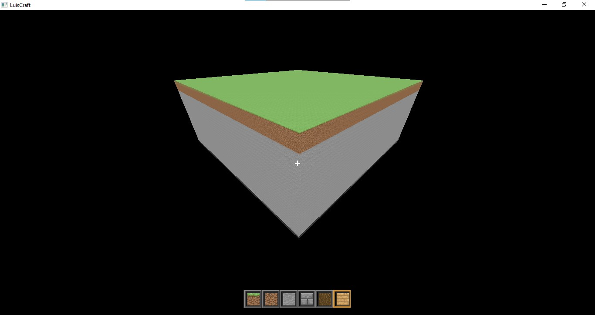
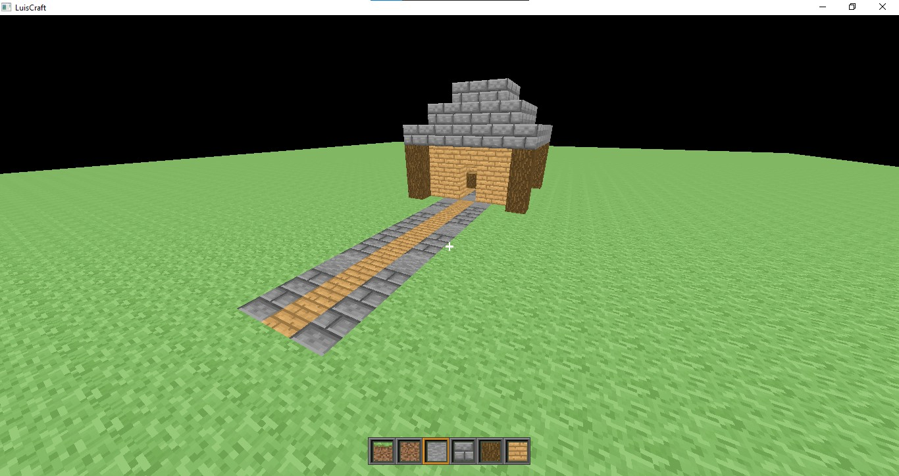
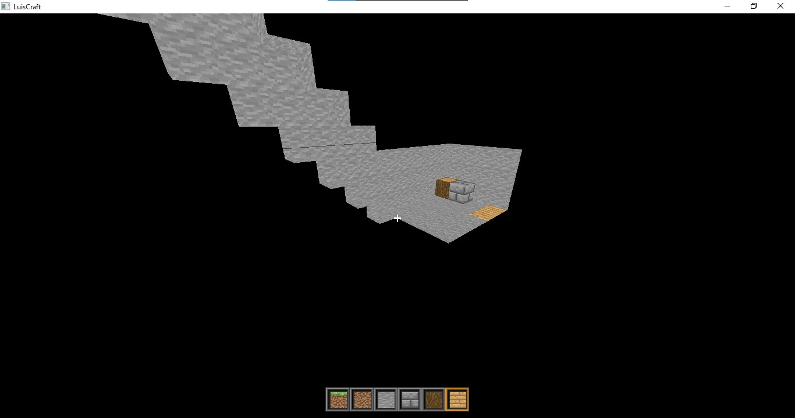

# Blocky Game
Minecraft is a game that I have always enjoyed and I decided that it would be a nice challenge to try and recreate it as best as I can.

To create it, I am using the Java programming as well as LWJGL3 and it's OpenGL bindings to develop this interactive 3D world. This means that in order to create the game I have to learn the basics of OpenGL, how to render things as well as deal with shaders.

The idea of this game I'm making is just to test my abilities and see if I am able to create a game that is similar to Minecraft. I do not intend to release this game as a completely original project but more of a challenge for myself and this repository is where I will be documenting my progress.

### Version History
Here will be a list of all the versions of the game

| Version             | Date of release |
|---------------------|-----------------|
| [Alpha 1](#alpha-1) | August 3, 2023  |

## Alpha 1
| Released August 3, 2023

This is the first official version of the game which includes the basic functionality of placing and breaking blocks, there is a hotbar which allows you to select from 6 different blocks available. This simple version is already capable of allowing creativity in creating builds regardless of how simple it currently is. You can also press 'F' to enter spectator mode and view your builds by flying.

#### Interesting Features
- Hotbar with 6 different blocks
- Relatively large plain terrain
- Spectator mode
- Player collisions with the blocks using a swept AABB algorithm

#### Screenshots

Here you can see the world that you are given and are free to alter in whatever way you may like.

Here is an example of a build that can be made. We have a nice small house where we can live in as well as a path leading up to it. Again the blocks you have are limited but you can still do whatever you want with them.

Here you can see an underground base that I built by carving into the terrain. We are also able to get this outside view into it by entering spectetor mode which allows us to go through blocks without colliding with them.